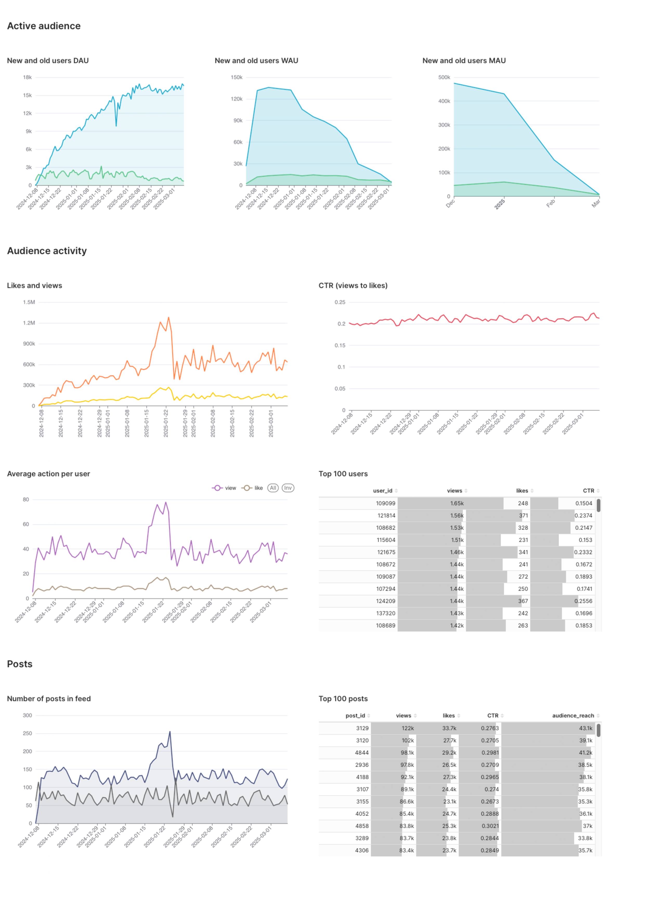

# Welcome to my Data Visualization Portfolio!

Here you can find a collection of my work in the field of data visualization. I specialize in creating clear and insightful charts, graphs, and interactive data visualizations that help businesses and individuals make data-driven decisions.

## What you'll find here:
- **Interactive dashboards** that showcase various datasets and their trends.
- **Case studies** where I explain the problem-solving process behind my visualizations.

---

# Dashboard 1 - News Feed Analytics

This dashboard provides insights into the key metrics of the news feed feature of the product. The primary focus of the analysis is to understand how users interact with the news feed and to track key events and user activities within it.

[SQL queries](queries/dashboard-1.sql)

# Dashboard 2 - Users demographics and geography

---
layout: default
title: Dashboard 2 - User Demographics
---

# Dashboard 2 - User Demographics and Characteristics

This dashboard provides insights into the demographic and technical characteristics of users interacting with the product. Understanding user attributes such as gender, age, location, operating system, and traffic source helps in tailoring content, optimizing user experience, and improving engagement strategies.

